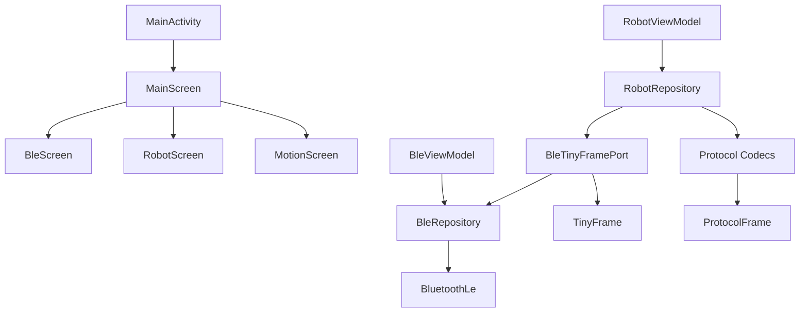
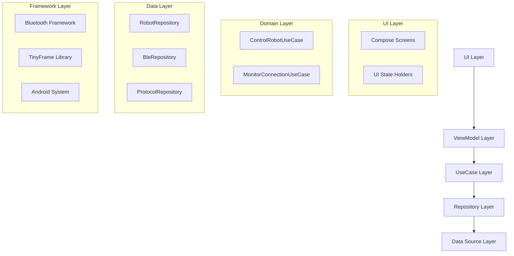

# RobotArmController 项目优化建议

## 项目概述
这是一个Android机械臂控制应用，使用Jetpack Compose构建UI，通过BLE蓝牙与硬件通信，采用TinyFrame协议进行数据帧传输。

### 当前架构

## 发现的问题与优化点

### 1. 代码结构与命名
- **文件名不一致**：`BleRepositoryr.kt` 有额外的 'r' 拼写错误
- **包结构冗余**：`data/tinyframe` 与 `tinyframe` 包存在重复的TinyFrame相关类
- **ViewModel职责过重**：BleViewModel包含扫描、连接、状态管理等多种职责

### 2. 错误处理与日志
- **错误处理不完整**：部分异常未被恰当捕获或传递给UI
- **日志级别混乱**：大量调试日志在发布版本中可能影响性能
- **用户反馈不足**：错误状态未充分展示给用户

### 3. 依赖注入与模块化
- **依赖关系复杂**：BleRepository与BleTinyFramePort存在循环依赖风险
- **缺少测试模块**：难以进行单元测试和集成测试
- **硬编码配置**：BLE服务UUID、超时时间等硬编码在代码中

### 4. 性能与资源管理
- **协程作用域管理**：多个Repository创建自己的CoroutineScope，缺乏统一生命周期管理
- **BLE连接状态恢复**：应用重启后无法自动恢复连接
- **内存泄漏风险**：未正确取消协程和监听器

### 5. 协议与数据层
- **协议解析耦合**：协议解析逻辑分散在多个Codec类中
- **数据验证缺失**：接收的数据帧缺少完整性验证
- **状态同步问题**：本地状态与硬件状态可能不同步

## 具体优化建议

### 架构优化

### 1. 代码质量改进
- **重命名文件**：将 `BleRepositoryr.kt` 改为 `BleRepository.kt`
- **统一包结构**：合并 `data/tinyframe` 和 `tinyframe` 包
- **提取接口**：为Repository创建接口以便测试和替换

### 2. 错误处理增强
- **统一错误类型**：定义 `AppError` sealed class 封装所有错误
- **错误传播机制**：通过Flow将错误从数据层传递到UI层
- **用户友好提示**：将技术错误转换为用户可理解的消息

### 3. 依赖注入优化
- **模块拆分**：将 `BleModule` 拆分为多个专注于单一职责的模块
- **作用域管理**：使用 `@ApplicationScope` 和 `@ActivityScope` 管理依赖生命周期
- **测试支持**：创建测试专用的Hilt模块

### 4. 性能优化
- **协程统一管理**：使用 `Application` 级别的 `CoroutineScope` 并统一取消
- **连接状态持久化**：使用 `DataStore` 保存连接信息和设备地址
- **资源清理**：实现 `onCleared` 和 `onDestroy` 中的资源释放

### 5. 协议层改进
- **协议解析工厂**：创建 `ProtocolParserFactory` 统一管理所有协议解析
- **数据校验**：添加CRC校验和帧完整性验证
- **状态同步机制**：实现定期状态查询和差异同步

### 6. 测试策略
- **单元测试**：为Repository、UseCase、ViewModel编写测试
- **集成测试**：使用 `FakeBleRepository` 模拟BLE通信
- **UI测试**：使用Compose Testing测试界面交互

## 实施优先级

### 高优先级（立即实施）
1. 修复 `BleRepositoryr.kt` 文件名错误
2. 添加连接状态持久化
3. 统一错误处理机制
4. 增强日志管理（使用Timber）

### 中优先级（近期实施）
1. 重构包结构，消除重复
2. 优化依赖注入模块
3. 添加单元测试框架
4. 实现协议数据校验

### 低优先级（未来规划）
1. 实现完整的离线模式
2. 添加动作序列录制功能
3. 支持多设备同时连接
4. 添加数据分析和统计

## 技术债务清理清单

1. **命名规范**
   - [ ] 修复 `BleRepositoryr.kt` 文件名
   - [ ] 统一ViewModel命名后缀
   - [ ] 统一协议常量命名风格

2. **代码结构**
   - [ ] 合并重复的TinyFrame相关类
   - [ ] 提取通用工具类到 `utils` 包
   - [ ] 创建 `common` 模块存放共享类型

3. **依赖管理**
   - [ ] 更新依赖版本到最新稳定版
   - [ ] 移除未使用的依赖项
   - [ ] 统一Kotlin和Compose版本

4. **资源管理**
   - [ ] 添加字符串资源国际化支持
   - [ ] 统一颜色和主题定义
   - [ ] 优化图片资源大小

## 预期收益

### 可维护性提升
- 代码结构更清晰，新成员上手更快
- 模块化设计便于功能扩展和修改
- 测试覆盖率提高，减少回归错误

### 稳定性增强
- 错误处理更完善，崩溃率降低
- 资源管理更严格，内存泄漏减少
- 连接状态更稳定，用户体验提升

### 性能优化
- 响应速度提升，UI更流畅
- 电量消耗降低，蓝牙通信优化
- 内存使用减少，应用更轻量

## 后续步骤

1. **评估工作量**：团队讨论确定优化优先级
2. **制定迭代计划**：将优化任务拆分为多个Sprint
3. **建立代码审查**：确保优化符合代码规范
4. **监控效果**：通过崩溃报告和性能监控验证优化效果

---

*本优化计划基于对 `com.example.robotarmcontroller` 包内所有文件的全面分析生成。*
*分析时间：2026-02-14*
*分析文件数：28个Kotlin文件*